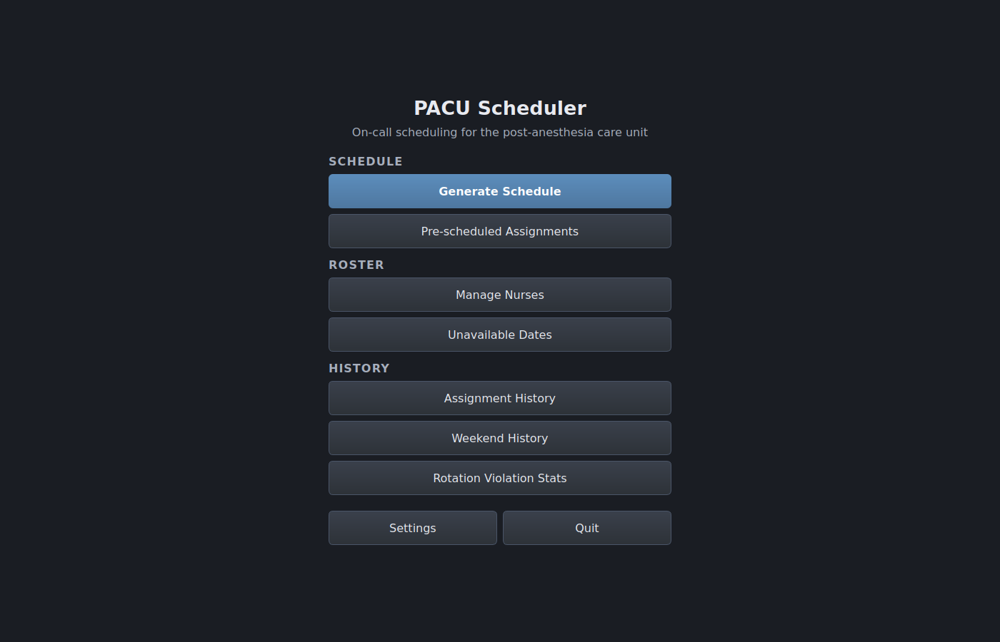
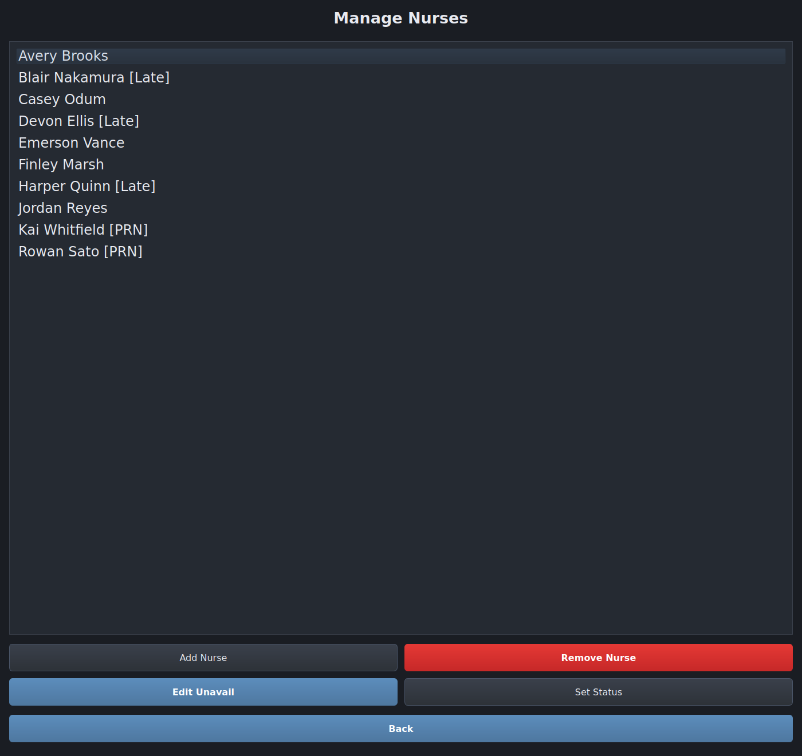
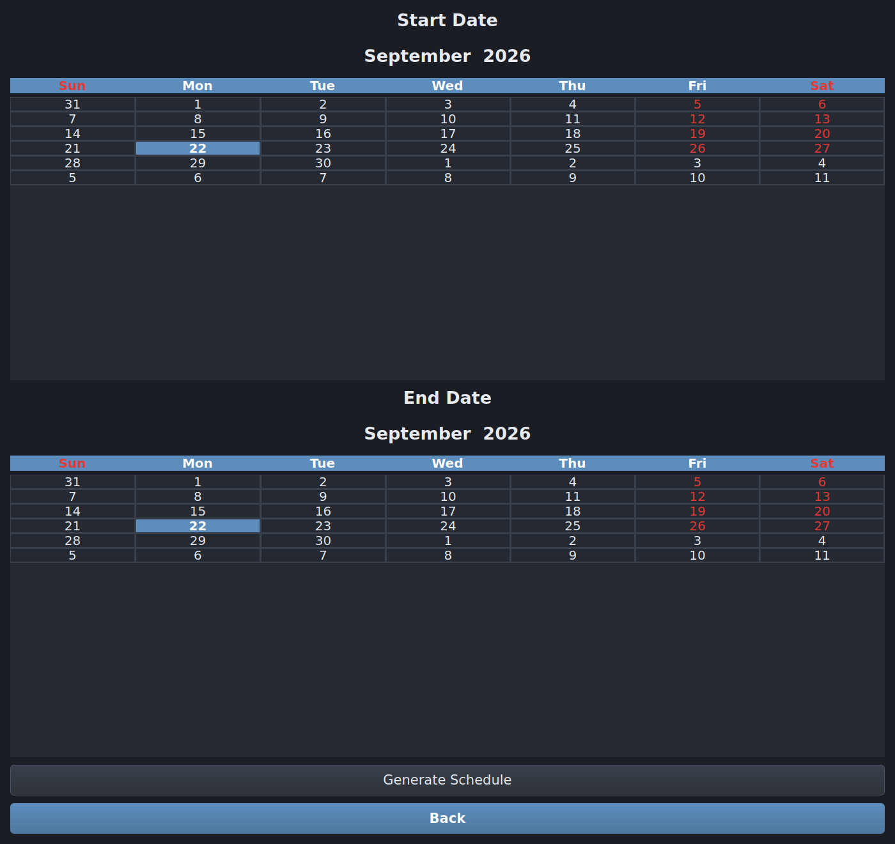
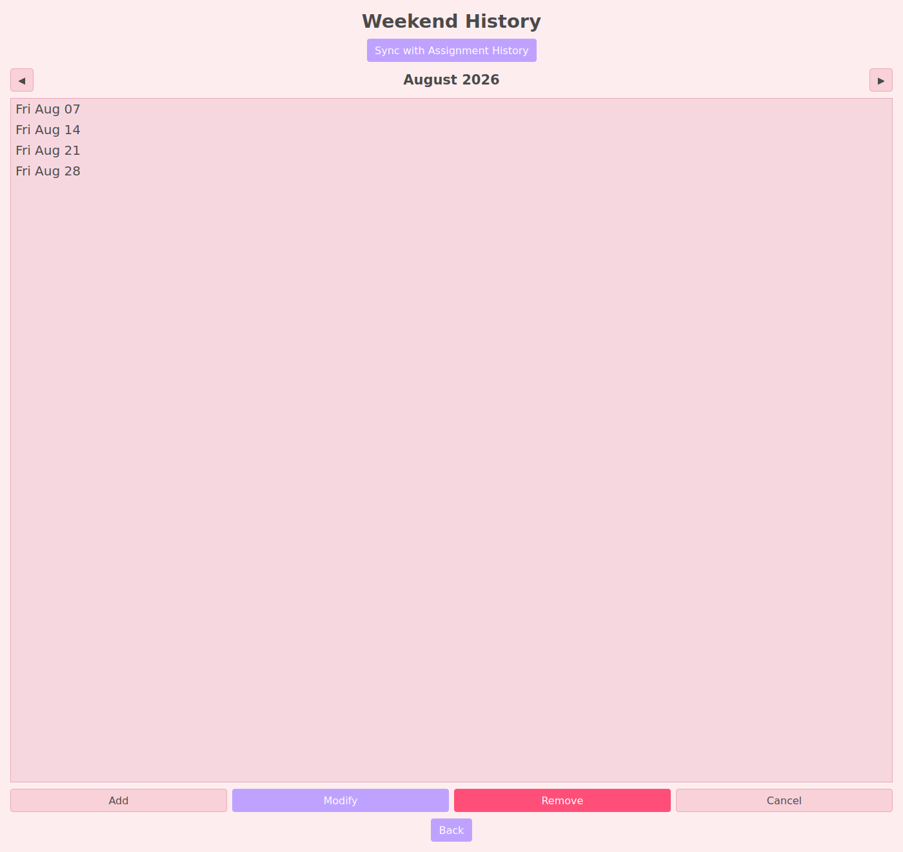
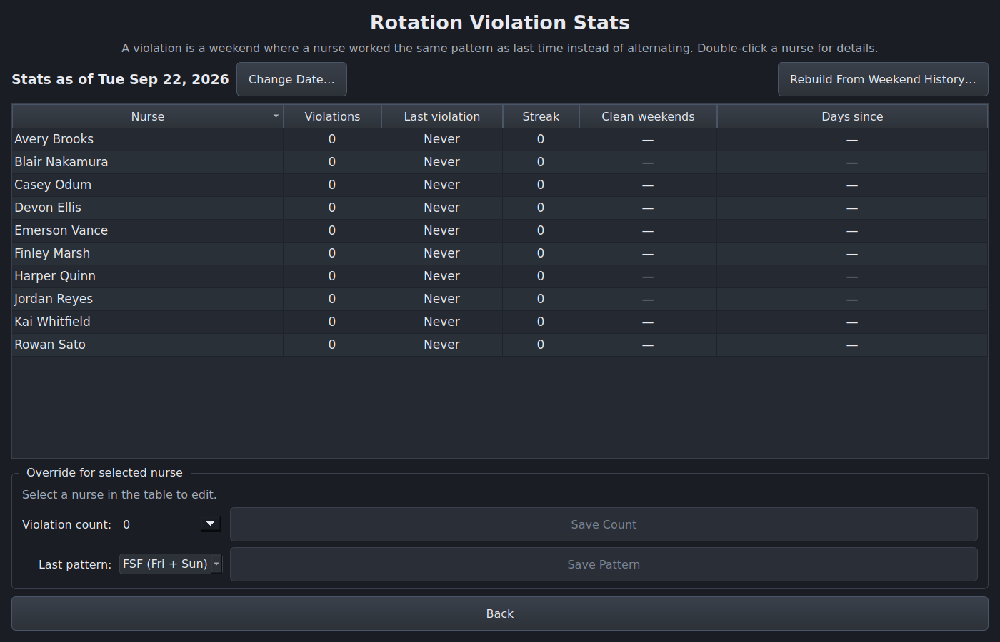

# PACU Scheduler

[](https://github.com/jr-mccoy/pacu-scheduler/actions/workflows/ci.yml)
[](https://www.python.org/downloads/)
[](LICENSE)

A desktop and terminal application that builds on-call schedules for a
post-anesthesia care unit (PACU) nursing team.



Call scheduling in a small unit is a constraint-satisfaction problem with a
fairness objective layered on top. Each day needs a **Main** and a **Backup**
nurse. Weekends run in one of two rotation patterns — `FSF` (Friday/Sunday) and
`SFS` (Saturday) — and a nurse who worked one pattern is expected to alternate
to the other next time. On top of that, the scheduler has to respect
time-off requests, minimum spacing between assignments, late-shift pairing
rules, and any assignments a manager has pinned in advance (PRN, as-needed,
nurses are scheduled only when pinned) —
while spreading Main and Backup duty evenly across the team.

This project generates candidate schedules, scores them, and presents the best
options for a manager to review and approve.

## Try it

The repository ships no database, so there is nothing to schedule on a fresh
clone. `scripts/demo.py` seeds a throwaway one with a fictional roster,
weekend history, and time-off requests, runs the real generation pipeline,
and prints the winning schedule. It takes about a minute:

```bash
python -m pip install -r requirements.txt
python scripts/demo.py
```

```
Best schedule — Aug 24, 2026 to Sep 20, 2026
==============================================================
                      main          backup
2026-08-24  Blair Nakamura      Casey Odum
2026-08-25     Devon Ellis   Emerson Vance
2026-08-26    Jordan Reyes    Avery Brooks
...

Assignment balance across 8 nurses
--------------------------------------------------------------
Nurse                     Main    Backup   Total
Avery Brooks                 3         4       7
Blair Nakamura               4         3       7
Casey Odum                   3         4       7
...
```

Every name in the demo is invented; no real staffing data is in this
repository.

## How it works

Generation runs in two stages, because weekends are the scarce resource and
constrain everything else:

1. **Weekend generation.** The scheduler enumerates valid `FSF`/`SFS` pairs for
   each weekend in the horizon, branching on every complete pair. Because the
   variant count grows roughly as `(valid pairs) ^ (weekends)`, the pool is
   pruned after each weekend to `max_weekend_variants` (default 1,000), keeping
   the variants with the fewest rotation repeats, the most even weekend spread,
   and the largest minimum weekend gap.
2. **Weekday completion and rebalancing.** Each surviving weekend variant is
   filled in across weekdays, then run through an iterative window-refill
   rebalance pass that evens out Main/Backup counts without violating the hard
   constraints.

Surviving variants are then ranked:

1. fewest weekend-pattern repeats;
2. then fewest unfilled slots;
3. then a weighted score over weekend spacing, balance, long-term fairness,
   and who absorbs any repeats.

The weights (Settings → Ranking weights) only order candidates that tie on
the first two. The top candidates are surfaced in a review dialog. The GUI,
the terminal UI and `generate_schedule()` all run the same pipeline,
`NurseScheduler.run_generation()`.

## Architecture

The application was originally a pair of single-file monoliths and has since
been decomposed into three packages with a one-way dependency flow
(`cli`/`ui` → `scheduler`):

| Package | Responsibility |
| --- | --- |
| `scheduler/` | Scheduling state, persistence, constraints, evaluation, optimization, ranking, diagnostics, and PDF export. No UI imports. |
| `ui/` | Qt application shell, themes, settings, widgets, dialogs, screens, presenters, and export services. |
| `cli/` | Terminal input and menu workflows. |

`scheduler/legacy_core.py` and `ui/legacy.py` remain as import-compatibility
facades; neither contains application logic, and a test enforces that.

## Screens

| | |
| --- | --- |
|  |  |
| Roster management, with PRN and late-shift eligibility | Picking the horizon to schedule |
|  |  |
| Who worked each weekend, and in which pattern | Per-nurse rotation violations, with manual overrides |

Regenerate these from the demo seed with `python scripts/screenshots.py`.

Every screen follows the same conventions: Esc goes back, Enter edits the
selected row, Delete removes it, and Ctrl+N adds. Dialogs cancel on Esc.
Generation can be cancelled. [`docs/ui-ux-audit.md`](docs/ui-ux-audit.md)
records the UI/UX audit behind these conventions.

## Setup

Requires Python 3.11+.

```bash
python -m pip install -r requirements.txt
```

Launch the desktop GUI:

```bash
python main.py
```

Or the terminal UI:

```bash
python -m cli
```

On first run the application creates `nurse_schedule.db` in the working
directory from `scheduler/schema.sql`. The database starts empty — add your
team through **Nurse Management** before generating a schedule. No database is
checked into this repository, and `.gitignore` excludes `*.db` so scheduling
data (which contains real staff names and time-off records) stays local.

## Development

```bash
python -m pip install -r requirements-dev.txt
pytest
```

Linting and formatting are both `ruff`, configured in `pyproject.toml`:

```bash
ruff check .
ruff format --check .
```

The GUI tests need a Qt platform plugin. On a headless machine:

```bash
QT_QPA_PLATFORM=offscreen pytest
```

On a bare Linux box, PySide6 also needs its native libraries present — it
links against them at import time, so even the offscreen plugin fails without
them:

```bash
sudo apt-get install -y libegl1 libgl1 libxkbcommon0 libdbus-1-3 libfontconfig1
```

### Diagnostics

Logging is configured at the entry points and the level comes from an
environment variable:

```bash
PACU_LOG_LEVEL=DEBUG python main.py
```

Two heavier traces are opt-in because they are expensive rather than merely
verbose. `SCHEDULE_VARIANT_DEBUG=1` prints every candidate slot the search
considers (thousands of lines per variant), and `DEBUG_SCHED=1` writes an
`assignment_debug_*.jsonl`/`.csv` pair into the working directory.

### Search budgets

Evaluation cost is dominated by the rebalance and refill passes, and their
budgets are tunable rather than fixed:

- `SchedulerConfig.max_weekend_variants` — beam cap on weekend branching
  (default 1,000; 0 means unlimited). Every survivor runs the full evaluation
  pipeline, so this is the main lever on total run time, and it grows roughly
  in proportion. Pruning is not feasibility-aware: a cap set too low can
  discard the branch that would have led to the only workable schedule, and
  the engine warns when that happens. Set it per machine as **Weekend
  variants to evaluate** in the GUI's Settings dialog, or under **Settings**
  in the terminal UI. Both write `~/.nurse_scheduler/settings.json`, so the
  value persists between sessions and the two interfaces share it.
- `SchedulerConfig.max_week_permutations` — cap on the slot orderings tried
  when rebalancing one week, or when gap-filling a week that cannot be
  filled completely. A Monday–Thursday week has up to eight modifiable slots
  (8! = 40,320 orderings). Below the cap every ordering is tried; above it,
  the given order plus seeded random shuffles, so every slot gets to go
  first.
- `WorkerTuningConfig` — pass counts, node budgets, and time limits for the
  gap-fill, rebalance, and refill passes. Hand it to `NurseScheduler` as
  `worker_tuning=`; it travels with each work item, so it reaches worker
  processes on every start method. `scripts/demo.py` uses a tightened profile.

Slots that no nurse can legally take (everyone is off, or the weekends rule
them all out) are detected once per variant and skipped by every search, so
one impossible day no longer stalls the passes around it.

`scripts/benchmark.py` times evaluation per variant for a budget profile and
reports what it produced, on the demo roster or on a variant of it with an
impossible day:

```bash
python scripts/benchmark.py --scenario blocked --tuning default --variants 5
```

Measured on a 4-core container, the per-variant times (default budgets, one
at a time) were:

| Scenario | Before the scheduler audit | After |
| --- | --- | --- |
| Demo roster | 14–24 s | 25–30 s, same result quality |
| Every nurse off one Wednesday | over 900 s (stopped) | about 25 s |

The two demo-roster columns evaluate different weekend variants, because the
beam now ranks branches differently, so compare them loosely. On this roster
the default budgets and the demo's tightened profile take the same time: the
budgets do not bind, and run time is set by the per-cell work described
under **Known limitations**. Re-measure on your own hardware before changing
the defaults.

### Parallelism

Variants are evaluated in a process pool, and evaluation is CPU-bound pure
Python, so wall-clock time falls almost linearly with worker count (the
4-week demo: 86 s on one worker, 47 s on two, 27 s on four). By default the
GUI, the terminal UI, and `generate_schedule()` size the pool to the machine:
one worker per physical core, less one core kept free for the desktop, and
never more than free memory allows at 256 MB per worker (a worker actually
peaks near 70 MB). Hyper-threaded siblings are not counted because they add
little to this workload.

Override the choice with an environment variable, or per call with
`generate_schedule(max_workers=...)`:

```bash
PACU_MAX_WORKERS=8 python main.py
```

## Scheduling policies

The scheduler applies these policies deliberately; each one trades automation
for operator control.

- **Weekend history is canonical.** Any weekend assignment edit
  (`add_assignment`, `modify_assignment`, `remove_assignment`, `restore`)
  rewrites derived state — `weekend_rotation_history`, violation dates and
  stats, in-memory last patterns — from `weekend_assignments`, so assignments,
  patterns, and violations cannot drift apart.
- **Manual overrides are temporary by design.**
  `set_violation_count` and `set_last_pattern` write operator overrides
  directly. They stand until the next canonical rebuild: any weekend
  assignment edit, applying a schedule, or "Rebuild Violation History".
- **Weekend generation defaults to strict-then-relaxed.** Strict alternation is
  attempted across the whole horizon first. If no variants survive, the relaxed
  retry runs only after `confirm_rotation_callback` approves it — and the
  default callback declines. `STRICT_ONLY` never introduces rotation repeats;
  an infeasible weekend fails generation rather than silently relaxing.
  `RELAXED_ALLOWED` starts relaxed. The GUI and the terminal UI use it when
  you allow violations up front.
- **Relaxed rotation repeats only where needed.** In relaxed mode each branch
  still uses alternating pairs whenever it has any. A repeat is admitted
  only on a weekend that branch cannot staff otherwise, and only for nurses
  allowed to violate. When strict rotation is feasible, relaxed mode yields
  the strict schedules.
- **Ranking is lexicographic before it is weighted.** Fewest pattern repeats
  wins, then fewest unfilled slots, and only then the weighted score. That
  score's metrics are normalized against fixed minimum scales, so a trivial
  difference does not earn a metric its full weight. The rotation-violation
  metric counts each new repeat as `1 + that nurse's earlier violations`,
  so unavoidable repeats go to the nurses who have had the fewest.
- **Rotation violations are attributed per candidate schedule.** Each
  `ScheduleVariant` records the pattern repeats introduced on its own branch, and
  `get_rotation_violation_history()` is rebuilt and deduplicated from the
  surviving variants, so pruned branches and shared ancestry do not inflate
  counts.
- **Pre-scheduled weekend conflicts are hard-blocking.** Candidate `FSF`/`SFS`
  pairs are rejected outright when they contradict a non-empty prefilled
  Friday, Saturday, or Sunday cell.
- **History is read relative to the window.** Rotation alternates against
  the last weekend recorded *before* the start date, and only weekends
  before it count as history. Weekends already recorded inside the range
  are the schedule being replaced. They are ignored while generating, the
  screen and the CLI say how many there are, and applying an option
  replaces them. A manual `set_last_pattern` override counts only while
  the nurse has no recorded weekend on or after the start date.
- **Committed work on both sides of the window is respected.** Days worked
  in the `min_days_between_assignments` window just before the start, or
  already committed just after the end, count toward weekday spacing. These
  come from weekend history, pre-scheduled cells and the
  `schedule_history` table. Weekends recorded or pre-scheduled after the
  end count toward the weekend gap and the pre-weekend window.
- **Weekends are scheduled whole.** A range that starts on a Saturday or
  Sunday, or ends on a Friday or Saturday, is widened to cover the whole
  weekend, and the screen shows the widened range. The exception is a cut
  weekend that is already recorded (usually by the previous month's run).
  Its days inside the range keep their recorded roles, so consecutive
  months never reshuffle each other's boundary weekend.
- **Generation only reads; applying writes everything at once.**
  Generating, cancelling or closing the review never touches history.
  Applying an option goes through `scheduler.apply_schedule()`, from both
  the GUI and the CLI. That records the per-day and weekend history for
  the option's dates in one transaction, replacing what was there, and
  rebuilds rotation state once.
- **A crash is an error, never "no feasible schedule".**
  `generate_weekend_candidates()` reports `ok`, `infeasible` or `error`,
  and `generate_schedule()` raises `GenerationError` instead of offering
  to relax rotation because of a bug.

## Known limitations

- **Evaluation is slow.** A single weekend variant takes on the order of tens
  of seconds, and a realistic horizon produces hundreds of variants. The cost
  is concentrated in per-cell pandas lookups (`DataFrame.at`) inside the
  eligibility and spacing checks, which run millions of times per variant.
  Making the hot path operate on plain dicts or arrays instead is the obvious
  next optimization.
- **The shipped `WorkerTuningConfig` budgets are far larger than they look** —
  the per-attempt time limits are 800 seconds each, multiplied by hundreds of
  passes. They effectively never bind, so run time is governed by how quickly
  the search happens to converge. Use `scripts/benchmark.py` to find budgets
  that bind without costing result quality on your hardware.
- **Weekend generation grows combinatorially.** Rosters much beyond ten nurses
  or horizons beyond about six weeks push variant counts up sharply.

## Documentation

- [`docs/weekend-candidate-generation.md`](docs/weekend-candidate-generation.md)
  — design spec for exhaustive weekend candidate generation and the manual
  exception workflow.
- [`docs/original_monolithic_scheduler_rules.md`](docs/original_monolithic_scheduler_rules.md)
  — the pre-refactor rules, kept as an architectural decision record and pinned
  by characterization tests.
- [`docs/ui-ux-audit.md`](docs/ui-ux-audit.md) — GUI audit findings, the
  conventions adopted, which settings were connected, and what was deferred.
- [`docs/scheduler-audit.md`](docs/scheduler-audit.md) — logic errors and
  oversights found in the scheduling engine, and the phased plan to fix them.

## License

[MIT](LICENSE)
