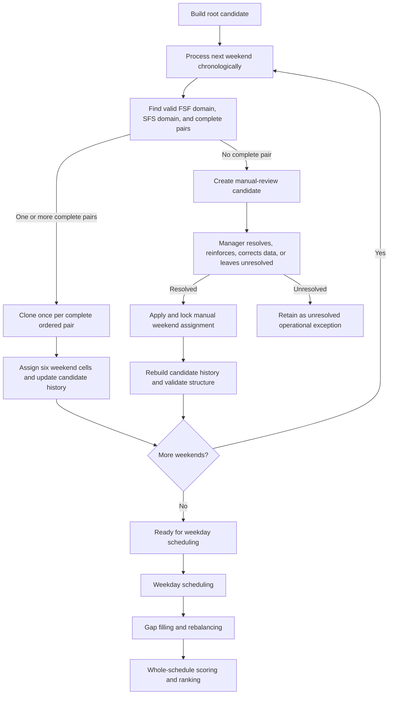

# Weekend Candidate Generation and Manual Exception Workflow

> **Status:** Design specification; implementation pending  
> **Audience:** Coding agents and maintainers working on weekend generation, weekday completion, rebalancing, and manager review  
> **Primary objective:** Preserve every automatically viable weekend schedule long enough to receive a fair weekday-completion attempt, while isolating incomplete weekends for explicit managerial intervention instead of silently discarding them.

## 1. Executive decision

Weekend generation must be **exhaustive with respect to complete valid weekend pairs**.

The scheduler must not eliminate a weekend candidate because its provisional fairness profile looks weak. Weekend-only fairness is incomplete: later weekday assignment, gap filling, and rebalancing can materially improve the final distribution of Main and Backup call.

The only automatic branch termination during weekend generation is structural:

- a weekend has no complete valid `FSF + SFS` pair under the configured automatic rules; or
- the candidate is otherwise impossible because of a true hard contradiction, such as an incompatible locked assignment.

A candidate that reaches an incomplete weekend is **not deleted**. It is copied into a manual-review queue with enough state and diagnostics for a manager to:

- bend an explicitly waivable rule;
- choose a less desirable but operationally acceptable pair;
- add reinforcement staff;
- correct availability or pre-scheduled data; or
- leave the candidate unresolved.

After manual resolution, the amended candidate re-enters weekend generation at the next weekend. Once every weekend is structurally complete, it proceeds through the normal weekday scheduler, gap-filling, rebalancing, and final ranking pipeline.

## 2. Existing repository behavior

The current implementation already contains important pieces of the desired model:

- `scheduler.engine.NurseScheduler.generate_all_weekend_variants()` creates an initial `ScheduleVariant` and processes weekends chronologically.
- `_get_valid_nurse_pairs()` returns ordered `(fsf_nurse, sfs_nurse)` pairs.
- Each successful pair produces a cloned `ScheduleVariant`.
- Candidate-specific state includes the schedule, `last_assignment`, `last_pattern`, and weekend tracking.
- Strict rotation can fall back to a relaxed branch, depending on `weekend_variant_mode` and the generation call.

The current limitation is the failure path. When a weekend leaves no surviving variants, generation eventually returns an empty list. A branch that had valid earlier weekends but cannot complete the current weekend is not retained as a reviewable object.

This specification changes that behavior from:

```text
no complete pair -> branch disappears
```

to:

```text
no complete pair -> branch becomes a manual-review candidate
```

## 3. Terminology

### 3.1 Weekend patterns

A standard weekend is Friday through Sunday and uses two distinct nurses.

| Pattern | Friday | Saturday | Sunday |
| --- | --- | --- | --- |
| `FSF` | Main | Backup | Main |
| `SFS` | Backup | Main | Backup |

A **complete weekend pair** is an ordered pair:

```text
(fsf_nurse, sfs_nurse)
```

The order is meaningful. Reversing the nurses reverses the role distribution.

### 3.2 Candidate

A **weekend candidate** is one isolated schedule version containing:

- the base schedule and all pre-scheduled cells;
- every weekend assignment already chosen in this branch;
- candidate-specific `last_assignment` values;
- candidate-specific `last_pattern` values;
- weekend tracking and assignment counts;
- any rotation-violation metadata;
- the index of the next weekend to process; and
- provenance for automatic and manual assignments.

Mutable state must never leak between candidates.

### 3.3 Manual-review candidate

A **manual-review candidate** is a weekend candidate that cannot automatically construct a complete pair for the current weekend. It retains all valid earlier assignments and the complete failure context for the unresolved weekend.

It is not an invalid schedule in the permanent sense. It is an operational exception awaiting a human decision.

## 4. Core invariants

### 4.1 Chronological history

Weekend `k` may consult:

- canonical weekend history from before the requested schedule period; and
- weekends `1` through `k - 1` from the same candidate.

It must not consult assignments from another candidate.

### 4.2 Candidate isolation

Each branch owns its mutable state. Assigning a nurse in one branch must not alter:

- another branch's schedule;
- another branch's `last_assignment`;
- another branch's `last_pattern`;
- another branch's counts;
- shared canonical history; or
- shared availability data.

Immutable problem data may be shared. Candidate state may not.

### 4.3 Immediate state updates

After a weekend is assigned, the candidate must immediately update:

- all six weekend schedule cells;
- the assigned nurses' last weekend dates;
- the assigned nurses' last patterns;
- weekend tracking;
- Main and Backup counts;
- any rotation-violation records; and
- assignment provenance.

Later weekends must evaluate against the updated candidate state.

### 4.4 No provisional fairness pruning

A candidate must not be removed merely because it currently has:

- uneven weekend counts;
- uneven Main or Backup counts;
- an unattractive provisional spread;
- nurses with zero weekend assignments;
- a worse weekend-only score than another candidate; or
- a poor score bound that assumes weekday assignments cannot compensate.

Every automatically complete weekend combination must receive a legitimate weekday-completion attempt under the same configured search effort.

### 4.5 Structural completeness before weekday scheduling

The ordinary weekday scheduler accepts only candidates whose weekends are structurally complete.

A candidate may reach this state through:

- fully automatic assignment;
- automatic assignment plus one or more manager-approved overrides; or
- reinforcement staff supplied during manual review.

### 4.6 Manual assignments are locked

A manager-approved weekend assignment must be marked as locked. Weekday search, gap filling, and rebalancing must not silently replace or erase it.

## 5. Candidate outcomes for one weekend

Pair discovery should preserve separate pattern domains before constructing pairs:

```text
valid_fsf_nurses
valid_sfs_nurses
complete_pairs
```

The result for a candidate/weekend is one of the following.

### 5.1 Complete automatic pair

At least one compatible ordered pair exists.

For every pair:

1. clone the candidate;
2. apply the full weekend assignment;
3. update candidate-specific history and counts; and
4. continue to the next weekend.

### 5.2 FSF-only partial result

At least one nurse can serve the `FSF` pattern, but no compatible `SFS` nurse can complete the weekend.

The candidate moves to manual review with:

- all valid FSF options;
- all rejected SFS options and reasons;
- any pair-level incompatibilities; and
- the unchanged schedule snapshot before the unresolved weekend.

### 5.3 SFS-only partial result

At least one nurse can serve the `SFS` pattern, but no compatible `FSF` nurse can complete the weekend.

The candidate moves to manual review with the corresponding diagnostics.

### 5.4 No pattern options

Neither pattern has a valid automatic nurse.

The candidate moves to manual review with every evaluated nurse and rejection reason.

### 5.5 Nonempty pattern domains but no compatible pair

Both pattern domains may contain nurses while the cross-product contains no usable pair. Examples include:

- the same single nurse is the only option for both patterns;
- every pair is a late-shift/late-shift combination blocked by policy;
- pair assignments conflict with prefilled weekend cells; or
- pair-level rules reject every cross-product combination.

This must be reported distinctly from "no nurses were eligible."

### 5.6 Hard contradiction

A candidate may contain a contradiction that cannot be repaired without changing locked facts. Examples include:

- two different nurses locked into the same schedule cell;
- a locked weekend pattern that implies mutually inconsistent Friday/Saturday/Sunday cells; or
- malformed data that prevents a structurally meaningful weekend assignment.

The candidate should still be recorded for diagnostics, but its review status should indicate that source data must be corrected before resolution.

## 6. Target pipeline



## 7. Generation result model

Weekend generation should return a structured result rather than only a list of successful variants.

```python
@dataclass
class WeekendGenerationResult:
    ready_candidates: list[ScheduleVariant]
    manual_review_candidates: list[ManualReviewCandidate]
    hard_error_candidates: list[ManualReviewCandidate]
    diagnostics: GenerationDiagnostics
```

The categories are operational, not necessarily permanent. A manual-review candidate may later become ready.

## 8. Proposed state objects

The names below are recommendations. Coding agents may adapt them to existing domain conventions, but the information boundaries should remain explicit.

### 8.1 Candidate status

```python
class CandidateStatus(Enum):
    GENERATING_WEEKENDS = "generating_weekends"
    MANUAL_REVIEW_REQUIRED = "manual_review_required"
    MANUALLY_RESOLVED = "manually_resolved"
    READY_FOR_WEEKDAY_SCHEDULING = "ready_for_weekday_scheduling"
    FULLY_SCHEDULED = "fully_scheduled"
    UNRESOLVED = "unresolved"
    SOURCE_DATA_CONFLICT = "source_data_conflict"
```

### 8.2 Exception type

```python
class WeekendExceptionType(Enum):
    MISSING_FSF = "missing_fsf"
    MISSING_SFS = "missing_sfs"
    MISSING_BOTH = "missing_both"
    NO_COMPATIBLE_PAIR = "no_compatible_pair"
    LOCKED_DATA_CONFLICT = "locked_data_conflict"
```

### 8.3 Weekend exception record

```python
@dataclass
class WeekendException:
    friday: pd.Timestamp
    exception_type: WeekendExceptionType
    valid_fsf_nurses: tuple[str, ...]
    valid_sfs_nurses: tuple[str, ...]
    rejected_nurses: dict[str, tuple[str, ...]]
    rejected_pairs: dict[tuple[str, str], tuple[str, ...]]
    prefilled_cells: dict[pd.Timestamp, dict[str, str | None]]
    affected_dates: tuple[pd.Timestamp, ...]
    automatic_mode_attempted: str
    manager_notes: str | None = None
```

### 8.4 Manual-review candidate

```python
@dataclass
class ManualReviewCandidate:
    candidate_id: str
    variant: ScheduleVariant
    unresolved_weekend_index: int
    exception: WeekendException
    status: CandidateStatus
    created_from_candidate_id: str | None
```

The candidate should contain or reference an isolated, serializable state snapshot.

### 8.5 Assignment provenance

Every weekend assignment should record its source.

```python
class AssignmentSource(Enum):
    AUTOMATIC_STRICT = "automatic_strict"
    AUTOMATIC_RELAXED = "automatic_relaxed"
    MANUAL_STANDARD = "manual_standard"
    MANAGER_OVERRIDE = "manager_override"
    REINFORCEMENT = "reinforcement"
    PRE_SCHEDULED = "pre_scheduled"
```

Provenance is audit data. It must not be inferred later from the final schedule alone.

## 9. Automatic generation algorithm

The algorithm must continue successful branches while separately retaining unsuccessful branches.

```python
def generate_all_weekend_candidates() -> WeekendGenerationResult:
    root = build_initial_variant()
    active = [root]
    manual_review = []
    hard_errors = []

    for weekend_index, friday in enumerate(weekends):
        next_active = []

        for candidate in active:
            discovery = discover_weekend_options(candidate, friday)

            if discovery.complete_pairs:
                for fsf_nurse, sfs_nurse in discovery.complete_pairs:
                    branch = candidate.clone()
                    branch.assign_weekend(friday, fsf_nurse, sfs_nurse)
                    branch.record_assignment_source(
                        friday,
                        discovery.source_for_pair(fsf_nurse, sfs_nurse),
                    )
                    next_active.append(branch)
                continue

            review_candidate = build_manual_review_candidate(
                candidate=candidate,
                weekend_index=weekend_index,
                friday=friday,
                discovery=discovery,
            )

            if discovery.has_locked_data_conflict:
                hard_errors.append(review_candidate)
            else:
                manual_review.append(review_candidate)

        active = next_active

    for candidate in active:
        candidate.status = CandidateStatus.READY_FOR_WEEKDAY_SCHEDULING

    return WeekendGenerationResult(
        ready_candidates=active,
        manual_review_candidates=manual_review,
        hard_error_candidates=hard_errors,
        diagnostics=build_generation_diagnostics(),
    )
```

Important behavior:

- Candidate A may continue while Candidate B from the same weekend is set aside.
- Failure of one branch must not erase successful sibling branches.
- Failure of all active branches must still return the manual-review candidates instead of returning only `[]`.

## 10. Manual resolution workflow

### 10.1 Review information

The manager should see:

- the unresolved Friday date;
- the full Friday-Sunday block;
- valid FSF options;
- valid SFS options;
- rejected nurses and reasons;
- rejected pairs and reasons;
- prior weekend assignments in this candidate;
- each nurse's recent weekend history and last pattern;
- relevant unavailable dates;
- pre-scheduled cells;
- surrounding weekday consequences;
- the automatic policy mode already attempted; and
- the exact rule or rules that would need an override.

### 10.2 Resolution actions

A manager may:

1. choose a complete pair that was available under a broader manual policy;
2. approve a named waivable-rule violation;
3. add or activate reinforcement staff, then recalculate pair options;
4. correct erroneous availability or pre-scheduled data;
5. replace a conflicting pre-scheduled entry with explicit authorization; or
6. leave the candidate unresolved.

The manager must not be forced to accept the scheduler's preferred option. The system should provide facts, consequences, and validation.

### 10.3 Required manual result

Before the candidate can resume, the weekend must contain:

- a structurally valid Friday-Sunday schedule;
- distinct people in simultaneous Main and Backup roles;
- a documented source for every overridden rule; and
- sufficient data to rebuild `last_assignment`, `last_pattern`, weekend tracking, and counts.

The preferred manual result remains a standard FSF/SFS pair. A future nonstandard split-weekend model would require separate design because it changes assumptions throughout history, scoring, and weekday spacing logic.

### 10.4 Resume behavior

```python
def resume_after_manual_resolution(
    review_candidate: ManualReviewCandidate,
    resolution: ManualWeekendResolution,
) -> WeekendGenerationResult:
    branch = review_candidate.variant.clone()

    validate_manual_resolution(branch, review_candidate.exception, resolution)
    apply_manual_weekend(branch, resolution)
    lock_manual_weekend(branch, resolution.friday)
    record_override_metadata(branch, resolution)
    rebuild_candidate_derived_state(branch)

    branch.status = CandidateStatus.MANUALLY_RESOLVED

    return continue_weekend_generation(
        candidate=branch,
        next_weekend_index=review_candidate.unresolved_weekend_index + 1,
    )
```

A manually repaired candidate must resume from its own state, not restart from the root and not borrow state from another branch.

## 11. Rule taxonomy

Manual review requires an explicit distinction between hard facts and waivable policy.

### 11.1 Usually non-waivable without correcting source data

Examples:

- one nurse assigned to both Main and Backup at the same time;
- two conflicting locked values in one cell;
- nonexistent nurse identity;
- malformed or incomplete date range;
- a weekend outside the candidate schedule;
- assignment state that cannot be reconstructed consistently.

### 11.2 Potentially waivable with manager acknowledgment

Exact policy must be configured, but candidates may include:

- repeat FSF or repeat SFS rotation;
- shorter-than-preferred weekend gap;
- second weekend before every nurse has a first;
- late-shift pairing restrictions;
- provisional fairness preferences;
- preferred pair repetition limits; or
- use of a lower-priority nurse.

### 11.3 Operationally sensitive facts

Some rules are technically overridable but should receive stronger warnings and possibly separate authorization:

- nurse-declared unavailability;
- approved leave;
- competency or qualification restrictions;
- contractual work-hour limits;
- mandatory rest requirements; and
- assignments that require overtime or on-call reinforcement.

The software should not label these as ordinary fairness exceptions.

## 12. Weekday scheduling and fairness

### 12.1 Equal completion opportunity

Every candidate in `READY_FOR_WEEKDAY_SCHEDULING` must receive the same configured weekday search effort.

A candidate must not look worse merely because its weekday scheduler was given:

- fewer search nodes;
- a shorter time budget;
- fewer order permutations;
- fewer gap-fill passes; or
- fewer rebalance attempts.

### 12.2 Final evaluation point

Comparative fairness should be evaluated after:

1. every weekend is complete;
2. weekday Main and Backup assignments have been attempted;
3. gap filling has run;
4. rebalancing has run; and
5. the completed candidate has been validated.

Final metrics may include:

- total assignments per nurse;
- Main spread;
- Backup spread;
- total-call spread;
- weekend count spread;
- weekday count spread;
- historical overage correction;
- weekend gap quality;
- repeat-pattern violations;
- unresolved weekday gaps;
- override count and severity; and
- reinforcement usage.

Manual provenance should remain visible even when a manually repaired candidate ranks highly.

### 12.3 One weekday result may be insufficient

If weekday completion is heuristic, one unlucky greedy completion can make a good weekend candidate appear poor. The preferred practical behavior is:

- optimize weekdays independently for each weekend candidate;
- use consistent budgets and objective ordering; and
- retain the best completed weekday state found for that candidate.

Generating every possible weekday schedule is not required by this specification, but every weekend candidate must receive a comparable and serious optimization attempt.

## 13. Performance without unfair pruning

Exhaustive weekend branching may become large. Performance work must preserve the semantic guarantee that automatically complete weekend candidates are not discarded because of provisional fairness.

Safe techniques include:

- share immutable problem data;
- copy only mutable candidate state;
- stream candidates instead of retaining every full DataFrame simultaneously;
- persist candidate snapshots to disk when memory pressure is high;
- parallelize weekday completion across finished weekend candidates;
- cache deterministic eligibility calculations;
- deduplicate only states proven behaviorally identical for all remaining decisions;
- group identical exception records while preserving candidate provenance; and
- retain only the best fully completed schedules after each candidate has received weekday completion.

Unsafe techniques include:

- dropping a candidate because its weekend counts are currently uneven;
- dropping a candidate because another branch has a better provisional score;
- estimating that weekday scheduling probably cannot compensate and treating that estimate as proof;
- silently capping variants without marking the search incomplete; or
- applying different weekday effort based on weekend-only rank.

If an explicit operational cap is ever added, the result must state that enumeration was incomplete and identify the stopping condition.

## 14. Proposed repository boundaries

Implementation should fit the existing decomposed architecture.

### 14.1 Existing components to reuse

- `scheduler/engine.py`
  - orchestration entry point;
  - current weekend pair discovery;
  - current strict/relaxed variant mode;
  - current generation loop.
- `scheduler/domain.py`
  - `ScheduleState`;
  - `ScheduleVariant`;
  - `WeekendPattern`;
  - configuration and quality models.
- `scheduler/generation/`
  - candidate-domain and ordering infrastructure;
  - stable search-context protocol.
- `scheduler/evaluation/`
  - weekday completion and candidate evaluation.
- `scheduler/optimization/`
  - gap filling, window refill, and rebalancing.
- `ui/presenters/variant_review_presenter.py`
  - existing pattern for presenting candidate review data.

### 14.2 Recommended additions

Possible modules:

```text
scheduler/generation/weekend_discovery.py
scheduler/generation/weekend_exceptions.py
scheduler/generation/weekend_resume.py
ui/presenters/weekend_exception_presenter.py
ui/dialogs/weekend_exception_review_dialog.py
```

Responsibilities:

- `weekend_discovery.py`
  - expose FSF domain, SFS domain, complete pairs, and rejection diagnostics;
- `weekend_exceptions.py`
  - own exception/status/provenance models;
- `weekend_resume.py`
  - validate manual resolutions and resume generation;
- presenter/dialog
  - provide manager review without placing scheduling policy in the UI.

The exact file split may change, but exception modeling should not be embedded as ad hoc dictionaries across the engine and UI.

## 15. Persistence and audit requirements

Manual review may occur later than generation. Review candidates should therefore be serializable.

At minimum, persist:

- candidate identifier;
- parent candidate identifier;
- schedule range;
- unresolved weekend index and Friday date;
- candidate state snapshot;
- exception type;
- valid and rejected options;
- rule-rejection diagnostics;
- current configuration/version;
- manager decision;
- manager notes;
- assignment provenance; and
- timestamps for creation and resolution.

A resumed candidate must be validated against current source data. If nurse availability, configuration, or pre-scheduled assignments changed after the exception was created, the UI should require recalculation or explicit acknowledgment.

## 16. Diagnostics requirements

Every candidate removed from active automatic generation must have an explicit destination and reason.

Generation diagnostics should answer:

- How many candidates entered each weekend?
- How many complete pairs were produced per candidate?
- How many child candidates were created?
- How many candidates moved to manual review?
- Which exception types occurred?
- Which rules rejected the most nurses or pairs?
- How many candidates were manually resolved?
- How many later returned to manual review?
- How many reached weekday scheduling?
- How many completed weekday scheduling successfully?

A bare message such as `no variants left` is insufficient for operator review.

## 17. Testing matrix

### 17.1 Automatic generation

- One weekend with one complete pair produces one candidate.
- One weekend with multiple ordered pairs produces one isolated candidate per pair.
- Later weekends use state from earlier weekends in the same branch.
- Sibling candidates never share mutable history or schedule cells.
- Strict generation and relaxed generation preserve assignment provenance.

### 17.2 Exception capture

- FSF options exist but SFS is empty.
- SFS options exist but FSF is empty.
- Both domains are empty.
- Both domains are nonempty but no compatible pair exists.
- Prefilled weekend cells conflict with every pair.
- Candidate A succeeds while sibling Candidate B becomes a manual-review candidate.
- All active candidates fail, but generation returns review candidates rather than only an empty list.

### 17.3 Manual resolution

- Manager chooses a standard pair and generation resumes at the next weekend.
- Manager approves a repeat-pattern override and provenance records the violation.
- Reinforcement staff becomes eligible and completes the pair.
- Manual assignment updates last assignment, last pattern, counts, and weekend tracking.
- A manually resolved weekend remains locked through weekday scheduling and rebalancing.
- A candidate may return to manual review on a later weekend without losing the earlier resolution.

### 17.4 Fairness behavior

- A weekend-imbalanced but structurally complete candidate survives to weekday scheduling.
- No candidate is removed using weekend-only Main, Backup, or total-call spread.
- All ready candidates receive equivalent weekday search configuration.
- Ranking occurs only after weekday completion and rebalancing.

### 17.5 Serialization

- Manual-review state round-trips without changing schedule cells or history.
- Resume after reload produces the same later pair domains as uninterrupted execution.
- Configuration drift is detected before resume.

## 18. Acceptance criteria

This design is implemented when all of the following are true:

1. Weekend generation returns successful and exception candidates in one structured result.
2. A failed branch is no longer silently discarded.
3. Complete sibling branches continue even when another sibling requires manual review.
4. Exception records distinguish missing FSF, missing SFS, missing both, no compatible pair, and locked-data conflict.
5. Manual review preserves the exact candidate state at the unresolved weekend.
6. A manager can apply and document a complete weekend resolution.
7. Resolved candidates rebuild derived state and resume at the next weekend.
8. Manual weekend assignments remain locked downstream.
9. Every weekend-complete candidate receives a comparable weekday scheduling, gap-fill, and rebalance attempt.
10. Final fairness ranking uses the completed schedule rather than provisional weekend-only fairness.
11. Diagnostics make every branch destination and rejection reason auditable.
12. Characterization tests preserve current strict/relaxed behavior except for the new exception-retention path.

## 19. Open decisions

Coding agents should not silently decide these policy questions. They require explicit product decisions:

- Which rules are waivable, and which require correction of source data?
- Does an override contribute a ranking penalty, or is it displayed only as audit metadata?
- Can reinforcement nurses be temporary candidate-local staff, or must they first be added to the canonical nurse repository?
- Must manual-review candidates persist in SQLite from the first implementation, or is an in-memory proof of concept acceptable?
- Can a manager edit earlier weekends in the candidate during review?
- Is a nonstandard split weekend ever permitted, or must all resolved weekends remain FSF/SFS?
- How should multiple manually resolved versions of the same candidate be represented?
- Should identical manual exceptions be grouped in the UI while retaining separate candidate lineage?

## 20. Implementation sequence

A low-risk sequence is:

### Phase 1: Domain and capture

- Add result, status, exception, and provenance models.
- Refactor pair discovery to expose FSF and SFS domains plus rejection reasons.
- Preserve failed branches as manual-review candidates.
- Add characterization tests.

### Phase 2: Resume API

- Add manual-resolution validation.
- Apply and lock a resolved weekend.
- Rebuild candidate-derived state.
- Resume generation from the next weekend.

### Phase 3: Weekday handoff

- Ensure automatic and manually resolved candidates use the same weekday pipeline.
- Verify manual locks survive gap filling and rebalancing.
- Enforce equal search budgets.

### Phase 4: Operator UI

- Add exception presenter and review dialog.
- Show rules, options, consequences, and provenance.
- Support resolution, reinforcement, correction, and unresolved disposition.

### Phase 5: Persistence and audit

- Persist review candidates and decisions.
- Detect stale snapshots/configuration drift.
- Add exportable diagnostics and manager notes.

---

## Final design rule

> An automatically incomplete weekend is not proof that the entire schedule is worthless. It is a boundary between algorithmic scheduling and operational judgment. Preserve the candidate, expose the exact failure, allow an authorized human to repair it, and then give the repaired schedule the same weekday-completion and fairness opportunity as every automatically completed candidate.
